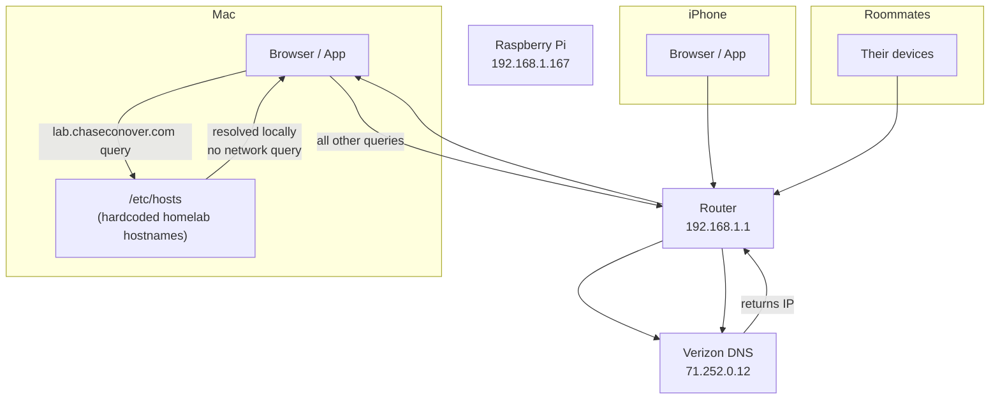
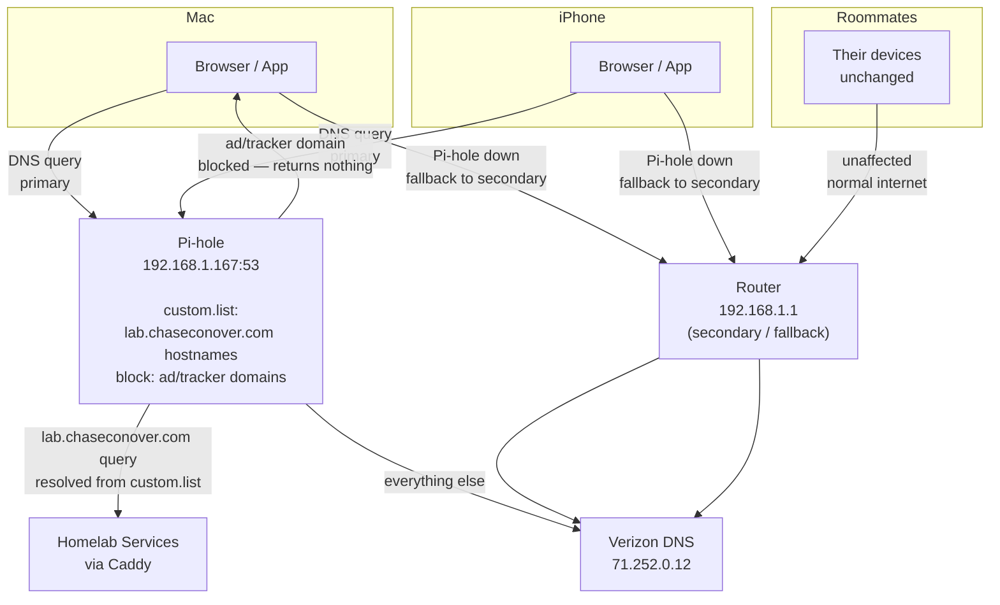
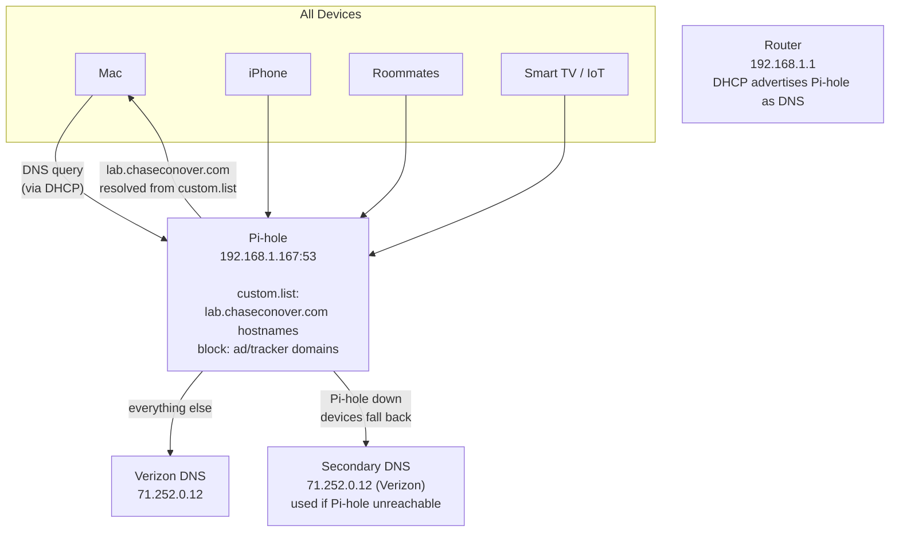
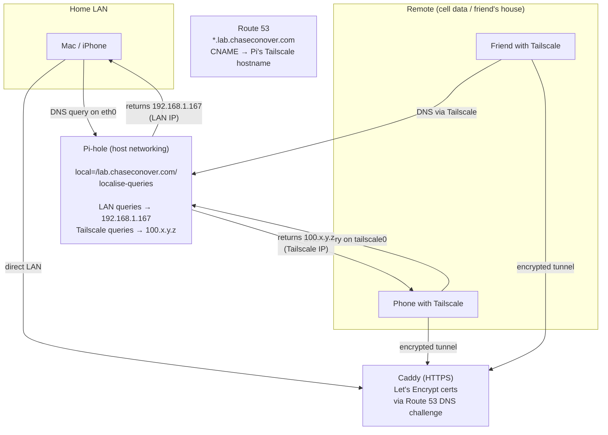

# DNS Routing Strategies

This document covers three approaches to DNS resolution for the homelab, including the tradeoffs of each and which was chosen.

DNS (Domain Name System) is the service that translates human-readable names like `tasks.lab.chaseconover.com` or `google.com` into IP addresses that computers actually route to. Every device on your network makes DNS queries constantly — every tab you open, every app that checks for updates.

---

## Strategy 1: Current State (router DNS + /etc/hosts)

Before Pi-hole. The Mac has homelab hostnames hardcoded in `/etc/hosts`. All other DNS goes through the router. The iPhone has no way to resolve homelab hostnames at all.

**Problems with this approach:**
- iPhone cannot reach homelab services by hostname — only by raw IP
- Adding a new service requires manually editing `/etc/hosts` on every device
- No ad blocking

---

## Strategy 2: Per-Device Pi-hole (chosen)

Each personal device (Mac, iPhone) is manually configured to use Pi-hole as its DNS server. The router and roommates' devices are completely unchanged.

**Device DNS configuration:**
| Device | Primary DNS | Secondary DNS |
|--------|-------------|---------------|
| Mac | `192.168.1.167` | `192.168.1.1` |
| iPhone | `192.168.1.167` | `192.168.1.1` |
| All others | (unchanged — via router) | |

**Why this approach was chosen:**
- Roommates are completely unaffected — no shared infrastructure changes
- Fallback to router → Verizon DNS if Pi is down, so internet still works
- Homelab hostnames resolve on Mac and iPhone without `/etc/hosts` entries
- New services added to `platform_services` are automatically resolvable after next deploy (Ansible regenerates `custom.list`)

---

## Strategy 3: Router-Level Pi-hole (reference)

The router is configured to advertise Pi-hole as the DNS server for all devices via DHCP. Every device on the network automatically uses Pi-hole without any per-device configuration.

**Why this was not chosen (yet):**
- Affects roommates without their knowledge
- Verizon CR1000A has hardcoded DNS server entries that cannot be deleted — custom DNS entries are added alongside Verizon's, not in place of them. Behavior when multiple DNS servers are configured is unpredictable.
- Per-device approach provides equivalent functionality for personal devices with no shared risk

**When to switch to this approach:**
- If you move to your own router hardware (not ISP-provided)
- If you live alone or roommates consent
- Once Pi-hole reliability is established over time

---

## Remote Access via Tailscale (current)

Tailscale provides secure remote access to the homelab from any network. Pi-hole uses **split horizon DNS** to return the right IP based on where the query comes from.

**How it works:**

1. Pi-hole runs with **host networking** so it can see whether a DNS query arrived on `eth0` (LAN) or `tailscale0` (Tailscale)
2. Each hostname has **two `address=` records** in dnsmasq — one LAN IP, one Tailscale IP
3. The `localise-queries` directive returns the IP matching the query's source subnet
4. The `local=/lab.chaseconover.com/` directive prevents Pi-hole from forwarding queries upstream to Route 53 (which would return the CNAME and override local records)
5. Caddy serves all requests over **HTTPS** with Let's Encrypt certificates provisioned via Route 53 DNS challenge

**DNS resolution by scenario:**

| Location | DNS server | Interface | IP returned | Connection |
|----------|-----------|-----------|-------------|------------|
| Home LAN | Pi-hole | eth0 | 192.168.1.167 | Direct |
| Home LAN, internet down | Pi-hole | eth0 | 192.168.1.167 | Direct (still works) |
| Remote via Tailscale | Pi-hole | tailscale0 | 100.x.y.z | Encrypted tunnel |
| Not on tailnet | Route 53 | N/A | Tailscale hostname (unreachable) | Blocked |

**Key dnsmasq config files:**

- `/etc/dnsmasq.d/01-tailscale.conf` — enables `localise-queries` and `local=/lab.chaseconover.com/`
- `/etc/dnsmasq.d/02-homelab.conf` — dual `address=` records for all services (auto-generated by Ansible)
