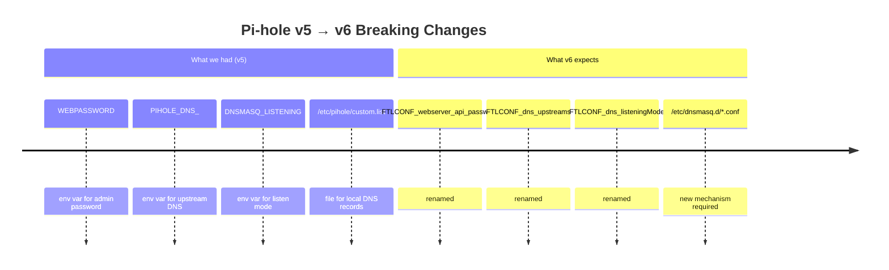

# Docker Image Versioning

## The Problem with `latest`

Every service in this stack uses a Docker image tag like `pihole/pihole:latest`. The `:latest` tag means "whatever the newest version is right now." When Docker pulls the image, it gets the current release — including any major version upgrades with breaking changes.

This caused a real incident when Pi-hole released v6:

**Symptoms when this happened:**
- Pi-hole started and showed healthy — the container was running
- Web admin password didn't work (v6 ignored `WEBPASSWORD`, generated a random one)
- External DNS queries timed out (v6 ignored `PIHOLE_DNS_`, had no upstream configured)
- Local `.lab.chaseconover.com` hostnames didn't resolve (`custom.list` silently ignored by v6)
- Port 53 firewall rule was also missing, compounding the diagnosis

---

## Pinned vs. Floating Tags

| Tag style | Example | Behavior |
|---|---|---|
| `latest` | `pihole/pihole:latest` | Always pulls newest — can break on major versions |
| Pinned major | `pihole/pihole:2025` | Locked to a major version — safe from breaking changes |
| Pinned exact | `pihole/pihole:2025.04.0` | Fully locked — never changes until you update manually |

**The tradeoff:** Pinned tags mean you control when you upgrade. You won't get security patches or bug fixes automatically, but you also won't get surprised by breaking changes.

---

## Current State

All services in this stack currently use `:latest`. This is a known risk. The plan is to pin all images to specific versions so that upgrades are deliberate, tested, and documented.

When upgrading a pinned image:
1. Check the project's changelog for breaking changes
2. Update the tag in the compose file
3. Run the deploy — docker compose will recreate the container with the new image
4. Verify the service is working before moving on

---

## Pi-hole v6 Config Reference

For future reference, the correct v6 environment variables are:

| Purpose | v5 variable | v6 variable |
|---|---|---|
| Admin password | `WEBPASSWORD` | `FTLCONF_webserver_api_password` |
| Upstream DNS | `PIHOLE_DNS_` | `FTLCONF_dns_upstreams` |
| Listen mode | `DNSMASQ_LISTENING` | `FTLCONF_dns_listeningMode` |
| Enable dnsmasq.d | (automatic) | `FTLCONF_misc_etc_dnsmasq_d: "true"` |

Local DNS records now live in `config/pihole/etc-dnsmasq/02-homelab.conf` as dnsmasq `address=` directives, generated by Ansible from `platform_services`.
